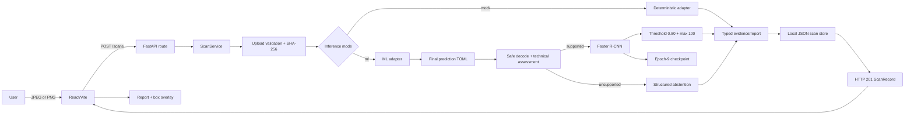
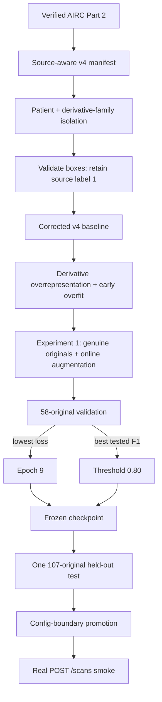

# OralLens AI Pipeline

## Purpose

This document maps each runtime and model-lifecycle step to the source that owns it. OralLens AI provides experimental screening support only; this flow does not create clinical validity.

## Runtime at a glance

## Runtime request flow

### 1. Select and preview

Owner: [`frontend/src/main.tsx`](../frontend/src/main.tsx)

The frontend accepts JPEG/PNG MIME-and-extension pairs, creates a local preview, and resets stale results. This is a user-experience gate; backend validation remains authoritative.

### 2. Submit the scan

Owners:

- [`frontend/src/main.tsx`](../frontend/src/main.tsx)
- [`backend/app/api/scans.py`](../backend/app/api/scans.py)
- [`backend/app/main.py`](../backend/app/main.py)

The browser posts multipart field `file` to `POST /scans`. FastAPI delegates the request to `ScanService` and returns a typed `ScanRecord` with HTTP `201` on success.

### 3. Validate and hash

Owner: [`backend/app/services/scan_service.py`](../backend/app/services/scan_service.py)

The service checks:

1. MIME allowlist
2. filename-extension allowlist
3. bounded chunked read
4. non-empty content
5. JPEG/PNG/WebP magic bytes
6. safe display filename
7. SHA-256 digest

The ML adapter accepts JPEG and PNG. A valid WebP upload reaches the API boundary but receives a concise `415` in ML mode.

### 4. Select the inference adapter

Owners:

- [`backend/app/config.py`](../backend/app/config.py)
- [`backend/app/main.py`](../backend/app/main.py)
- [`backend/app/pipeline/inference.py`](../backend/app/pipeline/inference.py)

`mock` is the default for lightweight development. The startup scripts select `ml` and point to the final inference config:

`ml/configs/orthodontic_plaque_detection_mvp_v4_originals_online_aug_predict.toml`

### 5. Cross the backend-to-ML boundary

Owner: [`backend/app/pipeline/inference.py`](../backend/app/pipeline/inference.py)

The adapter writes a UUID-named temporary JPEG/PNG under a constrained directory, verifies containment, calls the project-local ML package, validates the returned structure, and deletes the temporary input in a `finally` block. Unexpected internals are translated to `ML inference failed.`

### 6. Assess and infer

Owners:

- [`ml/src/orallens_ml/inference/input_assessment.py`](../ml/src/orallens_ml/inference/input_assessment.py)
- [`ml/src/orallens_ml/inference/detection.py`](../ml/src/orallens_ml/inference/detection.py)
- [`ml/src/orallens_ml/modeling/detection.py`](../ml/src/orallens_ml/modeling/detection.py)

The input is EXIF-normalized, decoded safely, converted to RGB `float32` `[0,1]`, and assessed before model construction. Current technical bounds are:

- minimum short side: 256 pixels
- maximum decoded pixels: 30,000,000
- mean luminance: 0.05 through 0.98
- minimum luminance standard deviation: 0.02

Supported images use the shared Faster R-CNN ResNet-50 FPN constructor with two classes and `512–768` resizing. The checkpoint is loaded with `weights_only=True` and checked for architecture compatibility.

Frozen inference contract:

- model: `orthodontic-plaque-mvp-v4-originals-online-aug-epoch9`
- checkpoint: `ml/runs/detection/orthodontic_plaque_part2_mvp_v4_originals_online_aug/checkpoint_best.pt`
- threshold: `0.80`
- maximum detections: `100`
- class `0`: implicit background
- class `1`: plaque-positive peri-tooth region candidate

### 7. Build and persist the response

Owners:

- [`backend/app/services/scan_service.py`](../backend/app/services/scan_service.py)
- [`backend/app/schemas.py`](../backend/app/schemas.py)
- [`backend/app/storage.py`](../backend/app/storage.py)

Supported results include model identity, maximum detector score, boxes, evidence, limitations, and disclaimer. Unsupported technical inputs return `prediction = null` with retake guidance. A supported zero-box result means only that no region exceeded `0.80`.

`JSONScanStore` writes local scan records through temporary-file replacement. This store is suitable for a local demonstration, not multi-user or regulated storage.

### 8. Render

Owner: [`frontend/src/main.tsx`](../frontend/src/main.tsx)

The UI displays the raw score as a ranking value, not a percentage, and maps pixel-space `xyxy` boxes onto the natural image coordinate system. Unsupported inputs suppress detector boxes and scores.

## Offline model lifecycle

### Dataset boundary

Owners:

- [`ml/src/orallens_ml/data/orthodontic_plaque_dataset.py`](../ml/src/orallens_ml/data/orthodontic_plaque_dataset.py)
- [`ml/src/orallens_ml/training/detection.py`](../ml/src/orallens_ml/training/detection.py)
- `ml/data/prepared/orthodontic_plaque/v4/part-2/manifest.csv` (ignored local artifact)

| Split | Genuine originals | Patients | Foreground regions |
|---|---:|---:|---:|
| Train | 480 | 55 | 5,502 |
| Validation | 58 | 7 | 710 |
| Test | 107 | 12 | 1,293 |

Patient groups and derivative/original families do not cross partitions.

### Controlled experiment

The corrected v4 baseline used 3,834 stored training rows and completed two epochs. Epoch 1 was best; epoch 2 reduced training loss while worsening validation loss.

Experiment 1 used 480 genuine originals with conservative online horizontal flip and color jitter. Sixteen maximum epochs provided 7,680 optimizer steps, close to the baseline's 7,668 completed steps. Epoch 9 minimized originals-only validation loss, and `0.80` maximized tested validation F1. The test set was then evaluated once.

Exact results and error counts: [Training and evaluation](TRAINING.md).

## Configuration map

| Purpose | Config |
|---|---|
| Corrected baseline training | `ml/configs/orthodontic_plaque_detection_mvp_v4.toml` |
| Baseline originals-only test | `ml/configs/orthodontic_plaque_detection_mvp_v4_baseline_test.toml` |
| Experiment 1 training | `ml/configs/orthodontic_plaque_detection_mvp_v4_originals_online_aug.toml` |
| Experiment 1 validation | `ml/configs/orthodontic_plaque_detection_mvp_v4_originals_online_aug_validation.toml` |
| Final application inference | `ml/configs/orthodontic_plaque_detection_mvp_v4_originals_online_aug_predict.toml` |

The final test configuration was instantiated from the baseline methodology with only the frozen checkpoint, threshold, and output identity replaced. Its resulting metrics artifact is the authoritative record.

## Local artifact map

All paths below are ignored by git.

| Evidence | Path |
|---|---|
| Final checkpoint | `ml/runs/detection/orthodontic_plaque_part2_mvp_v4_originals_online_aug/checkpoint_best.pt` |
| Training history | `ml/runs/detection/orthodontic_plaque_part2_mvp_v4_originals_online_aug/metrics.json` |
| Validation sweep | `ml/runs/detection/orthodontic_plaque_part2_mvp_v4_originals_online_aug_validation/evaluation_metrics.json` |
| Final test | `ml/runs/detection/orthodontic_plaque_part2_mvp_v4_originals_online_aug_test/evaluation_metrics.json` |
| Production smoke prediction | `ml/runs/detection/orthodontic_plaque_part2_mvp_v4_originals_online_aug_predictions/` |

Frozen checkpoint SHA-256:

`79CBB3B99D56F77E852B5096446649EFF17858A25B5FD40DAB9408FA7A2F19D7`

## Ownership and verification

| Boundary | Primary tests |
|---|---|
| upload/API/storage | `backend/tests/test_scans.py` |
| deployed config | `backend/tests/test_config.py` |
| backend-to-ML adapter | `backend/tests/test_inference_contract.py` |
| real checkpoint smoke | `backend/tests/test_ml_integration_smoke.py` |
| manifest/splits | `ml/tests/test_orthodontic_plaque_dataset.py`, `test_splits.py` |
| target conversion/augmentation | `ml/tests/test_detection_training.py` |
| checkpoint/model contract | `ml/tests/test_detection_modeling.py` |
| evaluation | `ml/tests/test_detection_evaluation.py` |
| inference/input assessment | `ml/tests/test_detection_inference.py`, `test_input_assessment.py` |
| browser workflow/accessibility | `frontend/tests/` |

## Intentional mismatch

Production applies technical-quality abstention before inference; offline test evaluation did not. This can cause production to reject an image rather than emit boxes. It is an explicit safety boundary, not a different detector or threshold.
