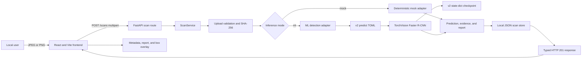
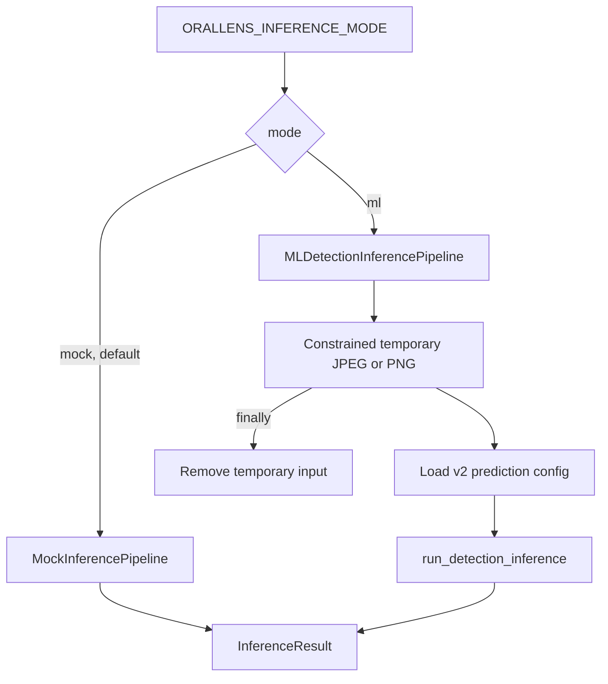
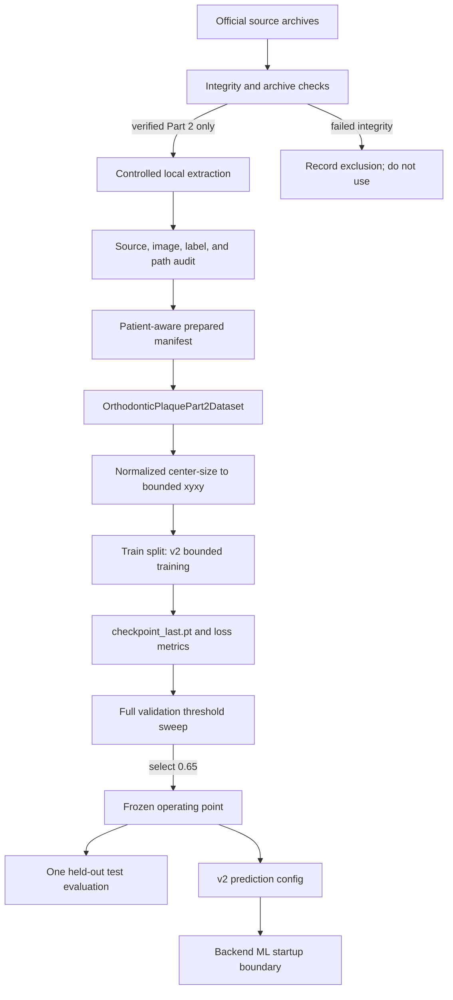

# OralLens AI Pipeline

## Purpose

This is the operational map for OralLens AI. It shows how an image, model, configuration, and generated artifact move through the system and links each step to the source file that owns it.

Use this document when you need to answer one of these questions quickly:

- Where does a browser upload go?
- Which layer validates it?
- How is mock mode different from real ML mode?
- Where are boxes converted, filtered, stored, and rendered?
- How does prepared data become a promoted checkpoint?
- Which config controls training, validation, test, or production-like local inference?
- Where should a change or test be made?

OralLens AI remains an experimental screening-support project. This pipeline does not produce a diagnosis, clinical validation, medical-device output, or treatment recommendation.

## System at a glance



The browser-facing runtime and the offline model-development lifecycle meet at one boundary: the v2 prediction config and checkpoint selected by the backend ML adapter.

## Runtime request pipeline

### 1. Select and preview an image

Owner: [`frontend/src/main.tsx`](../frontend/src/main.tsx)

`App` accepts JPEG or PNG, creates a local object URL, and resets the previous result when the selection changes. `ImagePreview` owns the natural image dimensions required to draw returned `xyxy` coordinates correctly.

Input: browser-selected file

Output: local preview and a `File` ready for submission

Failure behavior: submission is blocked when no file is selected; client-visible request errors render in an alert region.

### 2. Submit `POST /scans`

Owners:

- frontend request: [`frontend/src/main.tsx`](../frontend/src/main.tsx)
- API route: [`backend/app/api/scans.py`](../backend/app/api/scans.py)
- application wiring: [`backend/app/main.py`](../backend/app/main.py)

The frontend appends the file under multipart field `file`. FastAPI returns a typed `ScanRecord` with HTTP `201` when the service succeeds.

Local connection path:

```text
http://127.0.0.1:5173
        -> http://127.0.0.1:8000/scans
```

Explicit CORS origins and methods are configured in [`backend/app/config.py`](../backend/app/config.py) and installed in `create_app()`.

### 3. Validate the upload

Owner: [`backend/app/services/scan_service.py`](../backend/app/services/scan_service.py)

`ScanService.create_scan()` coordinates the request. `_read_and_validate()` applies these gates in order:

1. declared MIME type allowlist
2. filename-extension allowlist
3. chunked read with the configured byte limit
4. non-empty payload requirement
5. JPEG, PNG, or WebP magic-byte match
6. SHA-256 content digest

The original filename is reduced to a basename for display metadata and is never used as a storage path.

The general API boundary recognizes WebP, but the real ML adapter supports JPEG and PNG only. Unsupported ML input becomes a concise HTTP `415` rather than an inference traceback.

### 4. Select the inference adapter

Owners:

- typed settings: [`backend/app/config.py`](../backend/app/config.py)
- adapter construction: [`backend/app/main.py`](../backend/app/main.py)
- adapter contracts: [`backend/app/pipeline/inference.py`](../backend/app/pipeline/inference.py)



`mock` is the safe development/test default. The real-ML launch scripts explicitly set `ml`:

- [`backend/scripts/run-ml-server.ps1`](../backend/scripts/run-ml-server.ps1)
- [`backend/scripts/run-ml-server.cmd`](../backend/scripts/run-ml-server.cmd)

### 5. Cross the backend-to-ML boundary

Owner: [`backend/app/pipeline/inference.py`](../backend/app/pipeline/inference.py)

`MLDetectionInferencePipeline`:

1. maps the validated content type to a safe suffix
2. rejects a symlinked temporary directory
3. generates a UUID filename below the configured directory
4. verifies resolved path containment
5. loads the project-local ML package and inference config
6. invokes `run_detection_inference()`
7. converts ML predictions to backend `DetectionCandidate` records
8. removes the temporary image in a `finally` block

Unexpected detector exceptions become the generic domain error `ML inference failed.`; internal details are not sent to the browser.

### 6. Run detector inference

Owners:

- inference config and execution: [`ml/src/orallens_ml/inference/detection.py`](../ml/src/orallens_ml/inference/detection.py)
- model construction and checkpoint safety: [`ml/src/orallens_ml/modeling/detection.py`](../ml/src/orallens_ml/modeling/detection.py)
- active config: [`ml/configs/orthodontic_plaque_detection_mvp_v2_predict.toml`](../ml/configs/orthodontic_plaque_detection_mvp_v2_predict.toml)

The inference pipeline validates the image/config/checkpoint paths, chooses CUDA when `device = "auto"` and CUDA is available, builds Faster R-CNN with ResNet-50 FPN, and loads the project state dictionary with `weights_only=True`.

The active operating point is:

- score threshold: `0.65`
- maximum returned detections: `25`
- class `0`: background
- class `1`: plaque candidate

Output: pixel-space `xyxy` boxes, class labels, and detector scores written to a local prediction JSON artifact and returned to the backend adapter.

### 7. Build the screening-support report

Owners:

- orchestration and report text: [`backend/app/services/scan_service.py`](../backend/app/services/scan_service.py)
- typed response models: [`backend/app/schemas.py`](../backend/app/schemas.py)

The backend derives:

- result label and display name
- maximum returned detector score as `confidence`
- detection count and boxes
- evidence summary
- report summary
- limitations, next steps, and disclaimer

Detector confidence is not described as a calibrated probability of disease.

### 8. Persist the scan record

Owner: [`backend/app/storage.py`](../backend/app/storage.py)

`JSONScanStore` serializes typed scan records to `backend/var/scans.json`. It uses an in-process lock, sorts by creation time, writes a temporary JSON file, and replaces the destination.

This is local demonstration storage. It is not an authenticated, encrypted, multi-process, or regulated data store.

### 9. Translate errors and return the response

Owners:

- route/domain translation: [`backend/app/api/scans.py`](../backend/app/api/scans.py)
- exception envelopes: [`backend/app/error_handlers.py`](../backend/app/error_handlers.py)
- request IDs and request logging: [`backend/app/middleware.py`](../backend/app/middleware.py)
- JSON logging: [`backend/app/logging_config.py`](../backend/app/logging_config.py)

```text
UploadValidationError -> HTTP 400, 413, or 415
Unknown scan ID       -> HTTP 404
Request validation    -> structured HTTP 422
Unexpected exception  -> generic HTTP 500 + internal controlled logging
```

Client errors include a stable code, concise detail, and request ID. Raw stack traces and local paths are not returned.

### 10. Render the result

Owner: [`frontend/src/main.tsx`](../frontend/src/main.tsx)

`ResultPanel` renders model metadata, score, severity, detection count, evidence, report, limitations, next steps, and disclaimer. `ImagePreview` maps each returned pixel-space `xyxy` box into an SVG rectangle sharing the image's natural coordinate system.

## Offline data and model lifecycle



### Acquisition and preparation

| Responsibility | Source |
|---|---|
| release metadata, checksums, safe filenames | [`ml/src/orallens_ml/data/acquisition.py`](../ml/src/orallens_ml/data/acquisition.py) |
| archive inspection, traversal protection, extraction/listing | [`ml/src/orallens_ml/data/archive.py`](../ml/src/orallens_ml/data/archive.py) |
| general manifest records | [`ml/src/orallens_ml/data/manifest.py`](../ml/src/orallens_ml/data/manifest.py) |
| patient-aware assignment and isolation checks | [`ml/src/orallens_ml/data/splits.py`](../ml/src/orallens_ml/data/splits.py) |
| general duplicate/source/path audit | [`ml/src/orallens_ml/data/audit.py`](../ml/src/orallens_ml/data/audit.py) |
| Part 2 audit, manifest construction, exclusions, image validation | [`ml/src/orallens_ml/data/orthodontic_plaque.py`](../ml/src/orallens_ml/data/orthodontic_plaque.py) |
| dataset CLI commands | [`ml/src/orallens_ml/cli/dataset.py`](../ml/src/orallens_ml/cli/dataset.py) |

Part 1 is excluded because its nested archive failed official integrity validation. Part 2 produces a patient-aware manifest with fixed train, validation, and test assignments.

### Runtime dataset and targets

Owners:

- manifest/image loader: [`ml/src/orallens_ml/data/orthodontic_plaque_dataset.py`](../ml/src/orallens_ml/data/orthodontic_plaque_dataset.py)
- TorchVision target conversion: [`ml/src/orallens_ml/training/detection.py`](../ml/src/orallens_ml/training/detection.py)

The loader validates manifest schema, safe relative paths, root containment, symlinks, files, annotation JSON, finite numbers, and normalized fields. Target conversion derives corners, permits only `1e-6` of numerical boundary tolerance, clips tolerated crossings, and rejects gross or degenerate boxes.

### Training

Owners:

- CLI: [`ml/src/orallens_ml/cli/train.py`](../ml/src/orallens_ml/cli/train.py)
- implementation: [`ml/src/orallens_ml/training/detection.py`](../ml/src/orallens_ml/training/detection.py)
- config: [`ml/configs/orthodontic_plaque_detection_mvp_v2.toml`](../ml/configs/orthodontic_plaque_detection_mvp_v2.toml)

The v2 run uses train samples for optimizer steps and a bounded validation subset for loss monitoring. It writes a state-dict checkpoint and epoch metrics under the ignored run directory.

### Validation and threshold selection

Owners:

- CLI: [`ml/src/orallens_ml/cli/evaluate.py`](../ml/src/orallens_ml/cli/evaluate.py)
- implementation: [`ml/src/orallens_ml/evaluation/detection.py`](../ml/src/orallens_ml/evaluation/detection.py)
- config: [`ml/configs/orthodontic_plaque_detection_mvp_v2_eval.toml`](../ml/configs/orthodontic_plaque_detection_mvp_v2_eval.toml)

The evaluator processes the complete validation split across predefined score thresholds at IoU `0.5`. Threshold `0.65` produced the highest tested validation F1 and became the frozen operating point.

### Held-out test

Config: [`ml/configs/orthodontic_plaque_detection_mvp_v2_test.toml`](../ml/configs/orthodontic_plaque_detection_mvp_v2_test.toml)

The held-out config fixes split `test`, threshold `0.65`, IoU `0.5`, and no batch cap. Test metrics measure the already selected operating point and must not retune it.

### Promotion to the application

Promotion changes configuration, not API routes:

1. a trained checkpoint is selected by the v2 predict config
2. backend defaults point to that config
3. real-ML startup scripts set `ORALLENS_INFERENCE_MODE=ml`
4. backend integration tests exercise the adapter and real checkpoint
5. the browser consumes the unchanged `ScanRecord` response contract

## Configuration map

| Boundary | File or setting | Consumer |
|---|---|---|
| frontend API URL | `VITE_API_BASE_URL` | `frontend/src/main.tsx` |
| backend mode | `ORALLENS_INFERENCE_MODE` | `backend/app/main.py` |
| upload/CORS/storage paths | `ORALLENS_*` settings | `backend/app/config.py` |
| ML source path | `ORALLENS_ML_SOURCE_PATH` | backend ML adapter |
| ML prediction config | `ORALLENS_ML_DETECTION_CONFIG_PATH` | backend ML adapter |
| temporary input directory | `ORALLENS_ML_TEMP_DIR` | backend ML adapter |
| training experiment | `orthodontic_plaque_detection_mvp_v2.toml` | training CLI |
| validation sweep | `orthodontic_plaque_detection_mvp_v2_eval.toml` | evaluation CLI |
| frozen test | `orthodontic_plaque_detection_mvp_v2_test.toml` | evaluation CLI |
| local inference | `orthodontic_plaque_detection_mvp_v2_predict.toml` | prediction CLI and backend |

## Artifact map

| Artifact | Location | Version-control policy |
|---|---|---|
| raw and extracted data | `ml/data/raw/...` | ignored |
| prepared manifest | `ml/data/prepared/.../manifest.csv` | ignored |
| v2 checkpoint | `ml/runs/detection/orthodontic_plaque_part2_mvp_v2/checkpoint_last.pt` | ignored |
| training metrics | `ml/runs/detection/orthodontic_plaque_part2_mvp_v2/metrics.json` | ignored |
| validation metrics | `ml/runs/detection/orthodontic_plaque_part2_mvp_v2_eval/evaluation_metrics.json` | ignored |
| held-out metrics | `ml/runs/detection/orthodontic_plaque_part2_mvp_v2_test/evaluation_metrics.json` | ignored |
| prediction JSON | `ml/runs/detection/orthodontic_plaque_part2_mvp_v2_predictions/` | ignored |
| local scan records | `backend/var/scans.json` | ignored |
| temporary ML uploads | `backend/var/ml-inputs/` | ignored and deleted after each inference |
| frontend production build | `frontend/dist/` | ignored |

Ignored artifacts remain local evidence. They are not silently deleted, committed, or treated as source files.

## Security gates by boundary

| Boundary | Primary controls |
|---|---|
| Browser | JPEG/PNG picker, explicit API origin |
| API upload | MIME, extension, byte limit, non-empty content, magic bytes |
| Filename | basename-only display value; generated storage names |
| Temporary inference file | UUID name, suffix allowlist, containment, symlink rejection, `finally` cleanup |
| Dataset | UTF-8/CSV/JSON contract, finite values, normalized fields, path containment, symlink/file checks |
| Boxes | tolerance-bounded clipping, positive-area revalidation, gross-invalid rejection |
| Checkpoint | expected path, state-dict contract, `weights_only=True`, compatibility validation |
| Evaluation | validation-selected threshold, frozen test, concise domain errors |
| API errors | request IDs, stable envelope, no internal traceback/path disclosure |
| Persistence | local atomic replacement; explicitly not production storage |

## Test ownership

| Area | Tests |
|---|---|
| backend routes, CORS, uploads, errors, storage | `backend/tests/test_scans.py`, `test_health.py`, `test_hardening.py` |
| backend adapter and real ML smoke | `backend/tests/test_inference_contract.py`, `test_ml_integration_smoke.py` |
| backend v2 config boundary | `backend/tests/test_config.py` |
| acquisition, archives, manifests, splits, audits | `ml/tests/test_acquisition.py`, `test_archive.py`, `test_manifest.py`, `test_splits.py`, `test_audit.py` |
| Part 2 preparation and runtime dataset | `ml/tests/test_orthodontic_plaque.py`, `test_orthodontic_plaque_dataset.py` |
| model, training, evaluation, inference | `ml/tests/test_detection_modeling.py`, `test_detection_training.py`, `test_detection_evaluation.py`, `test_detection_inference.py` |
| CLI contracts and concise failures | `ml/tests/test_dataset_cli.py`, `test_ml_cli_entrypoints.py` |
| frontend | TypeScript production build and manual browser E2E; automated interaction/accessibility coverage remains pending |

## Where to make a change

| Desired change | Start here |
|---|---|
| upload type or size policy | `backend/app/config.py`, then `scan_service.py` and backend tests |
| API response field | `backend/app/schemas.py`, then service, frontend type, API docs, and tests |
| report wording | `backend/app/services/scan_service.py` |
| persistence implementation | `backend/app/storage.py` behind the existing service boundary |
| mock behavior | `backend/app/pipeline/inference.py` |
| backend model selection | typed config and startup scripts, not routes |
| score threshold | validation evidence first, then predict/test config policy; never tune from held-out test |
| detector architecture | `ml/src/orallens_ml/modeling/detection.py` plus configs and model tests |
| annotation policy | dataset loader/target conversion plus dataset and training tests |
| evaluation metric or matching | `ml/src/orallens_ml/evaluation/detection.py` plus evaluation tests |
| box rendering | `frontend/src/main.tsx` `ImagePreview` |
| result presentation | `frontend/src/main.tsx` `ResultPanel` |

## Related documents

- [Architecture](ARCHITECTURE.md) — structural boundaries and deployment context
- [API](API.md) — HTTP contracts and client-visible errors
- [Training and evaluation](TRAINING.md) — experiment evidence and metrics
- [Dataset card](DATASET_CARD.md) — provenance, splits, policy, and limitations
- [ML environment](ML_ENVIRONMENT.md) — local dependency and runtime setup
- [Root project guide](../README.md) — project-level entry point
