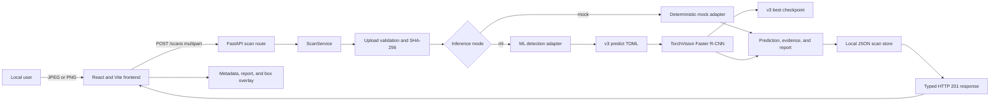
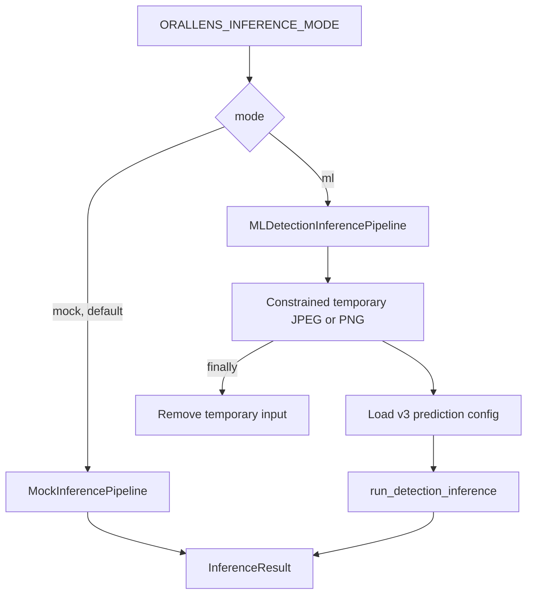
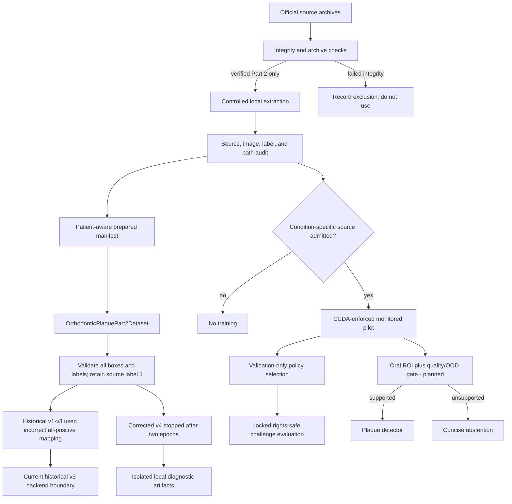

# OralLens AI Pipeline

## Purpose

This is the operational map for OralLens AI. It shows how an image, model, configuration, and generated artifact move through the system and links each step to the source file that owns it.

Use this document when you need to answer one of these questions quickly:

- Where does a browser upload go?
- Which layer validates it?
- How is mock mode different from real ML mode?
- Where are boxes converted, filtered, stored, and rendered?
- How does prepared data become a promoted checkpoint?
- Which config controls training, validation, test, or production-like local inference?
- Where should a change or test be made?

OralLens AI remains an experimental screening-support project. This pipeline does not produce a diagnosis, clinical validation, medical-device output, or treatment recommendation.

## System at a glance



The browser-facing runtime and offline model development meet at a configuration boundary. The application currently selects the historical v3 model through backend typed settings and the real-ML startup scripts. A corrected v4 diagnostic completed two epochs, was stopped after validation-loss reversal, and has not been evaluated, integrated, or promoted.

## Runtime request pipeline

### 1. Select and preview an image

Owner: [`frontend/src/main.tsx`](../frontend/src/main.tsx)

`App` accepts JPEG or PNG only when the declared MIME type matches a supported filename extension, creates a local object URL, and resets the previous result when the selection changes. This client check prevents an unnecessary request but is not a security substitute for backend content validation. `ImagePreview` owns the natural image dimensions required to draw returned `xyxy` coordinates correctly.

Input: browser-selected file

Output: local preview and a `File` ready for submission

Failure behavior: submission is blocked and focus returns to the file input when no file is selected or the selected MIME/extension pair is unsupported. Client-visible request errors render in an alert region.

### 2. Submit `POST /scans`

Owners:

- frontend request: [`frontend/src/main.tsx`](../frontend/src/main.tsx)
- API route: [`backend/app/api/scans.py`](../backend/app/api/scans.py)
- application wiring: [`backend/app/main.py`](../backend/app/main.py)

The frontend appends the file under multipart field `file`. FastAPI returns a typed `ScanRecord` with HTTP `201` when the service succeeds.

Local connection path:

```text
http://127.0.0.1:5173
        -> http://127.0.0.1:8000/scans
```

Explicit CORS origins and methods are configured in [`backend/app/config.py`](../backend/app/config.py) and installed in `create_app()`.

### 3. Validate the upload

Owner: [`backend/app/services/scan_service.py`](../backend/app/services/scan_service.py)

`ScanService.create_scan()` coordinates the request. `_read_and_validate()` applies these gates in order:

1. declared MIME type allowlist
2. filename-extension allowlist
3. chunked read with the configured byte limit
4. non-empty payload requirement
5. JPEG, PNG, or WebP magic-byte match
6. SHA-256 content digest

The original filename is reduced to a basename for display metadata and is never used as a storage path.

The general API boundary recognizes WebP, but the real ML adapter supports JPEG and PNG only. Unsupported ML input becomes a concise HTTP `415` rather than an inference traceback.

### 4. Select the inference adapter

Owners:

- typed settings: [`backend/app/config.py`](../backend/app/config.py)
- adapter construction: [`backend/app/main.py`](../backend/app/main.py)
- adapter contracts: [`backend/app/pipeline/inference.py`](../backend/app/pipeline/inference.py)



`mock` is the safe development/test default. The real-ML launch scripts explicitly set `ml`:

- [`backend/scripts/run-ml-server.ps1`](../backend/scripts/run-ml-server.ps1)
- [`backend/scripts/run-ml-server.cmd`](../backend/scripts/run-ml-server.cmd)

### 5. Cross the backend-to-ML boundary

Owner: [`backend/app/pipeline/inference.py`](../backend/app/pipeline/inference.py)

`MLDetectionInferencePipeline`:

1. maps the validated content type to a safe suffix
2. rejects a symlinked temporary directory
3. generates a UUID filename below the configured directory
4. verifies resolved path containment
5. loads the project-local ML package and inference config
6. invokes `run_detection_inference()`
7. converts ML predictions to backend `DetectionCandidate` records
8. removes the temporary image in a `finally` block

Unexpected detector exceptions become the generic domain error `ML inference failed.`; internal details are not sent to the browser.

### 6. Run detector inference

Owners:

- inference config and execution: [`ml/src/orallens_ml/inference/detection.py`](../ml/src/orallens_ml/inference/detection.py)
- model construction and checkpoint safety: [`ml/src/orallens_ml/modeling/detection.py`](../ml/src/orallens_ml/modeling/detection.py)
- active config: [`ml/configs/orthodontic_plaque_detection_mvp_v3_predict.toml`](../ml/configs/orthodontic_plaque_detection_mvp_v3_predict.toml)

The inference pipeline validates the image/config/checkpoint paths, chooses CUDA when `device = "auto"` and CUDA is available, builds Faster R-CNN with ResNet-50 FPN, and loads the project state dictionary with `weights_only=True`.

The historical active operating point is:

- score threshold: `0.85`
- maximum returned detections: `25`
- model identity: `orthodontic-plaque-mvp-v3`
- class `0`: background
- class `1`: plaque candidate

Output: pixel-space `xyxy` boxes, class labels, and detector scores written to a local prediction JSON artifact and returned to the backend adapter.

V3 was trained before the source-label semantic correction and is retained only as end-to-end engineering evidence. Its model-quality metrics are not valid plaque-only evidence.

### 7. Build the screening-support report

Owners:

- orchestration and report text: [`backend/app/services/scan_service.py`](../backend/app/services/scan_service.py)
- typed response models: [`backend/app/schemas.py`](../backend/app/schemas.py)

The backend derives:

- result label and display name
- maximum returned detector score as `confidence`
- detection count and boxes
- evidence summary
- report summary
- limitations, next steps, and disclaimer

The API compatibility field `confidence` contains a detector ranking score. Reports describe it as a maximum detector score, and the UI renders it to three decimals with an explicit “not a clinical probability” qualifier rather than percentage conversion.

### 8. Persist the scan record

Owner: [`backend/app/storage.py`](../backend/app/storage.py)

`JSONScanStore` serializes typed scan records to `backend/var/scans.json`. It uses an in-process lock, sorts by creation time, writes a temporary JSON file, and replaces the destination.

This is local demonstration storage. It is not an authenticated, encrypted, multi-process, or regulated data store.

### 9. Translate errors and return the response

Owners:

- route/domain translation: [`backend/app/api/scans.py`](../backend/app/api/scans.py)
- exception envelopes: [`backend/app/error_handlers.py`](../backend/app/error_handlers.py)
- request IDs and request logging: [`backend/app/middleware.py`](../backend/app/middleware.py)
- JSON logging: [`backend/app/logging_config.py`](../backend/app/logging_config.py)

```text
UploadValidationError -> HTTP 400, 413, or 415
Unknown scan ID       -> HTTP 404
Request validation    -> structured HTTP 422
Unexpected exception  -> generic HTTP 500 + internal controlled logging
```

Client errors include a stable code, concise detail, and request ID. Raw stack traces and local paths are not returned.

### 10. Render the result

Owner: [`frontend/src/main.tsx`](../frontend/src/main.tsx)

`ResultPanel` renders model metadata, score, severity, detection count, evidence, report, limitations, next steps, and disclaimer. `ImagePreview` maps each returned pixel-space `xyxy` box into an SVG rectangle sharing the image's natural coordinate system. A polite live region announces scanning and completion; visible focus and reduced-motion styles support keyboard and motion-sensitive users.

## Offline data and model lifecycle



### Acquisition and preparation

| Responsibility | Source |
|---|---|
| release metadata, checksums, safe filenames | [`ml/src/orallens_ml/data/acquisition.py`](../ml/src/orallens_ml/data/acquisition.py) |
| archive inspection, traversal protection, extraction/listing | [`ml/src/orallens_ml/data/archive.py`](../ml/src/orallens_ml/data/archive.py) |
| general manifest records | [`ml/src/orallens_ml/data/manifest.py`](../ml/src/orallens_ml/data/manifest.py) |
| patient-aware assignment and isolation checks | [`ml/src/orallens_ml/data/splits.py`](../ml/src/orallens_ml/data/splits.py) |
| general duplicate/source/path audit | [`ml/src/orallens_ml/data/audit.py`](../ml/src/orallens_ml/data/audit.py) |
| Part 2 audit, manifest construction, exclusions, image validation | [`ml/src/orallens_ml/data/orthodontic_plaque.py`](../ml/src/orallens_ml/data/orthodontic_plaque.py) |
| dataset CLI commands | [`ml/src/orallens_ml/cli/dataset.py`](../ml/src/orallens_ml/cli/dataset.py) |

Part 1 is excluded because its nested archive failed official integrity validation. Part 2 produces a patient-aware manifest with fixed train, validation, and test assignments.

### Runtime dataset and targets

Owners:

- manifest/image loader: [`ml/src/orallens_ml/data/orthodontic_plaque_dataset.py`](../ml/src/orallens_ml/data/orthodontic_plaque_dataset.py)
- TorchVision target conversion: [`ml/src/orallens_ml/training/detection.py`](../ml/src/orallens_ml/training/detection.py)

The loader validates manifest schema, safe relative paths, root containment, symlinks, files, annotation JSON, finite numbers, and normalized fields. Target conversion validates every source label in `{0, 1}` and every box, derives corners, permits only `1e-6` of numerical boundary tolerance, clips tolerated crossings, rejects gross or degenerate boxes, and retains only source label `1` as plaque objects. Source label `0` means plaque absent in an annotated region; detector class `0` remains implicit background.

### Historical v3 training

Owners:

- CLI: [`ml/src/orallens_ml/cli/train.py`](../ml/src/orallens_ml/cli/train.py)
- implementation: [`ml/src/orallens_ml/training/detection.py`](../ml/src/orallens_ml/training/detection.py)
- config: [`ml/configs/orthodontic_plaque_detection_mvp_v3.toml`](../ml/configs/orthodontic_plaque_detection_mvp_v3.toml)

The v3 run used every training and validation image in each of three epochs. It writes atomic last/best checkpoints after every completed epoch, including model, optimizer, RNG, config, and metric state required for safe interruption recovery. It also used the incorrect all-positive source-label mapping. No future experiment may resume v3.

### Stopped corrected v4 diagnostic

Owners:

- config: [`ml/configs/orthodontic_plaque_detection_mvp_v4.toml`](../ml/configs/orthodontic_plaque_detection_mvp_v4.toml)
- local ignored output: `ml/runs/detection/orthodontic_plaque_part2_mvp_v4/`

V4 used the corrected plaque-present conversion and source-aware manifest but the same underlying AIRC image distribution. It completed exactly two epochs. Training loss decreased from `0.7967` to `0.6149`, while validation loss worsened from `0.8250` to `1.0287`; epoch 1 is the best checkpoint. The run stopped before epoch 3 and must not be resumed, evaluated, integrated, or promoted. Its checkpoint device records show the CUDA code path, but the run did not collect utilization or throughput telemetry.

The next training branch begins only after one condition-specific task and a genuinely complementary source pass admission. That branch requires explicit CUDA, runtime telemetry, a monitored smoke test, and a small predeclared pilot before validation-only policy selection.

### Validation and threshold selection

Owners:

- CLI: [`ml/src/orallens_ml/cli/evaluate.py`](../ml/src/orallens_ml/cli/evaluate.py)
- implementation: [`ml/src/orallens_ml/evaluation/detection.py`](../ml/src/orallens_ml/evaluation/detection.py)
- config: [`ml/configs/orthodontic_plaque_detection_mvp_v3_eval.toml`](../ml/configs/orthodontic_plaque_detection_mvp_v3_eval.toml)

The evaluator processed the complete validation split across predefined score thresholds at IoU `0.5`. Under the historical target mapping, threshold `0.85` produced the highest tested v3 validation F1 (`0.7776`). This is retained as a reproducibility record, not valid plaque-only evidence.

### Fixed-threshold internal test

Config: [`ml/configs/orthodontic_plaque_detection_mvp_v3_test.toml`](../ml/configs/orthodontic_plaque_detection_mvp_v3_test.toml)

The v3 test config fixes split `test`, threshold `0.85`, IoU `0.5`, and no batch cap. It historically produced F1 `0.7795` without retuning, but that number inherits the target defect. The cohort has also been examined for v2 and v3 and cannot serve as v4's locked challenge boundary.

### Trustworthiness reporting

Owners:

- implementation: [`ml/src/orallens_ml/evaluation/trustworthiness.py`](../ml/src/orallens_ml/evaluation/trustworthiness.py)
- validation config: [`ml/configs/orthodontic_plaque_detection_mvp_v3_trust_validation.toml`](../ml/configs/orthodontic_plaque_detection_mvp_v3_trust_validation.toml)
- fixed-threshold test config: [`ml/configs/orthodontic_plaque_detection_mvp_v3_trust_test.toml`](../ml/configs/orthodontic_plaque_detection_mvp_v3_trust_test.toml)

The trustworthiness evaluator references the existing evaluation and prediction configs instead of duplicating the operating policy. It records:

- deployed 25-result cap versus uncapped metrics
- per-image and per-patient TP, FP, FN, and matched IoU
- score-to-match ECE, MCE, Brier score, and reliability bins
- structured high-score false positives and false-negative image identifiers
- SHA-256 identities for checkpoint, manifest, and configs
- runtime, model, split, threshold, IoU, and coordinate-space metadata

No v3 validation image reached the 25-result cap. One test image exceeded it by one historical false positive. The trust report structure remains useful provenance evidence, but its match and score-reliability values inherit the incorrect targets and are not valid plaque or disease calibration.

### Promotion to the application

Promotion changes configuration, not API routes:

1. a trained checkpoint and validation-selected threshold are fixed in a prediction config
2. backend defaults and startup scripts point to the promoted config
3. real-ML startup scripts set `ORALLENS_INFERENCE_MODE=ml`
4. backend integration tests exercise the adapter and real checkpoint
5. the browser consumes the unchanged `ScanRecord` response contract

V3 promotion is complete as historical application wiring. The backend default, PowerShell and CMD launchers, prediction model identity, integration smoke, full test suites, frontend build, and browser E2E verify the application contract, not current model quality. V4 is stopped and ineligible for promotion. A future condition model requires the admission, CUDA-preflight, pilot, validation, challenge, and integration gates in [Data strategy](DATA_STRATEGY.md).

## Configuration map

| Boundary | File or setting | Consumer |
|---|---|---|
| frontend API URL | `VITE_API_BASE_URL` | `frontend/src/main.tsx` |
| backend mode | `ORALLENS_INFERENCE_MODE` | `backend/app/main.py` |
| upload/CORS/storage paths | `ORALLENS_*` settings | `backend/app/config.py` |
| ML source path | `ORALLENS_ML_SOURCE_PATH` | backend ML adapter |
| ML prediction config | `ORALLENS_ML_DETECTION_CONFIG_PATH` | backend ML adapter |
| temporary input directory | `ORALLENS_ML_TEMP_DIR` | backend ML adapter |
| v3 training experiment | `orthodontic_plaque_detection_mvp_v3.toml` | training CLI |
| v3 validation sweep | `orthodontic_plaque_detection_mvp_v3_eval.toml` | evaluation CLI |
| v3 fixed-threshold internal test | `orthodontic_plaque_detection_mvp_v3_test.toml` | evaluation CLI |
| v3 active application inference | `orthodontic_plaque_detection_mvp_v3_predict.toml` | prediction CLI and backend ML adapter |
| v3 validation trust report | `orthodontic_plaque_detection_mvp_v3_trust_validation.toml` | trustworthiness evaluation CLI |
| v3 test trust report | `orthodontic_plaque_detection_mvp_v3_trust_test.toml` | trustworthiness evaluation CLI |
| stopped v4 diagnostic training | `orthodontic_plaque_detection_mvp_v4.toml` | historical training CLI evidence; do not resume |
| v4 validation/resume configs | v4 evaluation and resume TOML files | present but not authorized for execution |

## Artifact map

| Artifact | Location | Version-control policy |
|---|---|---|
| raw and extracted data | `ml/data/raw/...` | ignored |
| prepared manifest | `ml/data/prepared/.../manifest.csv` | ignored |
| historical v2 checkpoint | `ml/runs/detection/orthodontic_plaque_part2_mvp_v2/checkpoint_last.pt` | ignored |
| active v3 last/best checkpoints | `ml/runs/detection/orthodontic_plaque_part2_mvp_v3/checkpoint_*.pt` | ignored |
| v3 training metrics | `ml/runs/detection/orthodontic_plaque_part2_mvp_v3/metrics.json` | ignored |
| v3 validation metrics | `ml/runs/detection/orthodontic_plaque_part2_mvp_v3_eval/evaluation_metrics.json` | ignored |
| v3 internal test metrics | `ml/runs/detection/orthodontic_plaque_part2_mvp_v3_test/evaluation_metrics.json` | ignored |
| v3 validation trust report | `ml/runs/detection/orthodontic_plaque_part2_mvp_v3_trust_validation/trustworthiness_report.json` | ignored |
| v3 test trust report | `ml/runs/detection/orthodontic_plaque_part2_mvp_v3_trust_test/trustworthiness_report.json` | ignored |
| v3 prediction JSON | `ml/runs/detection/orthodontic_plaque_part2_mvp_v3_predictions/` | ignored |
| stopped v4 checkpoints and metrics | `ml/runs/detection/orthodontic_plaque_part2_mvp_v4/` | ignored local evidence; no evaluation or promotion |
| local scan records | `backend/var/scans.json` | ignored |
| temporary ML uploads | `backend/var/ml-inputs/` | ignored and deleted after each inference |
| frontend production build | `frontend/dist/` | ignored |
| Playwright failure evidence and HTML report | `frontend/test-results/`, `frontend/playwright-report/` | ignored |

Ignored artifacts remain local evidence. They are not silently deleted, committed, or treated as source files.

## Security gates by boundary

| Boundary | Primary controls |
|---|---|
| Browser | JPEG/PNG MIME-and-extension preflight, explicit API origin, safe generic non-JSON error fallback |
| API upload | MIME, extension, byte limit, non-empty content, magic bytes |
| Filename | basename-only display value; generated storage names |
| Temporary inference file | UUID name, suffix allowlist, containment, symlink rejection, `finally` cleanup |
| Dataset | UTF-8/CSV/JSON contract, finite values, normalized fields, path containment, symlink/file checks |
| Boxes and labels | source-label allowlist, plaque-only target filtering, tolerance-bounded clipping, positive-area revalidation, gross-invalid rejection |
| Checkpoint | expected path, state-dict contract, `weights_only=True`, compatibility validation |
| Evaluation | validation-selected threshold, frozen test, concise domain errors, complete-split trust reports, provenance hashes |
| API errors | request IDs, stable envelope, no internal traceback/path disclosure |
| Persistence | local atomic replacement; explicitly not production storage |

## Test ownership

| Area | Tests |
|---|---|
| backend routes, CORS, uploads, errors, storage | `backend/tests/test_scans.py`, `test_health.py`, `test_hardening.py` |
| backend adapter and real ML smoke | `backend/tests/test_inference_contract.py`, `test_ml_integration_smoke.py` |
| backend v3 config and model-identity boundary | `backend/tests/test_config.py` |
| acquisition, archives, manifests, splits, audits | `ml/tests/test_acquisition.py`, `test_archive.py`, `test_manifest.py`, `test_splits.py`, `test_audit.py` |
| Part 2 preparation and runtime dataset | `ml/tests/test_orthodontic_plaque.py`, `test_orthodontic_plaque_dataset.py` |
| model, training, evaluation, trustworthiness, inference | `ml/tests/test_detection_modeling.py`, `test_detection_training.py`, `test_detection_evaluation.py`, `test_detection_trustworthiness.py`, `test_detection_inference.py` |
| CLI contracts and concise failures | `ml/tests/test_dataset_cli.py`, `test_ml_cli_entrypoints.py` |
| frontend interaction and accessibility | `frontend/tests/orallens.spec.ts`; Chromium workflows plus axe WCAG A/AA checks, configured by `frontend/playwright.config.ts` |
| frontend production integration | TypeScript/Vite production build plus manual real-backend/v3 browser scan |

## Where to make a change

| Desired change | Start here |
|---|---|
| upload type or size policy | `backend/app/config.py`, then `scan_service.py` and backend tests |
| API response field | `backend/app/schemas.py`, then service, frontend type, API docs, and tests |
| report wording | `backend/app/services/scan_service.py` |
| persistence implementation | `backend/app/storage.py` behind the existing service boundary |
| mock behavior | `backend/app/pipeline/inference.py` |
| backend model selection | typed config and startup scripts, not routes |
| score threshold | validation evidence first, then predict/test config policy; never tune from a locked evaluation cohort |
| detector architecture | `ml/src/orallens_ml/modeling/detection.py` plus configs and model tests |
| annotation policy | dataset loader/target conversion plus dataset and training tests |
| evaluation metric or matching | `ml/src/orallens_ml/evaluation/detection.py` plus evaluation tests |
| box rendering | `frontend/src/main.tsx` `ImagePreview` |
| result presentation | `frontend/src/main.tsx` `ResultPanel` |
| frontend interaction/accessibility behavior | `frontend/src/main.tsx`, `frontend/src/styles.css`, then `frontend/tests/orallens.spec.ts` |

## Related documents

- [Data strategy](DATA_STRATEGY.md) - condition-specific source decisions, admission gates, and future experiment plan

- [Architecture](ARCHITECTURE.md) — structural boundaries and deployment context
- [API](API.md) — HTTP contracts and client-visible errors
- [Training and evaluation](TRAINING.md) — experiment evidence and metrics
- [Dataset card](DATASET_CARD.md) — provenance, splits, policy, and limitations
- [Intended use and claims](INTENDED_USE_AND_CLAIMS.md) — claim boundary and staged research target
- [Clinical evidence plan](CLINICAL_EVIDENCE_PLAN.md) — external and prospective evidence plan
- [Data acquisition and annotation](DATA_ACQUISITION_AND_ANNOTATION.md) — future clinical data contract
- [ML environment](ML_ENVIRONMENT.md) — local dependency and runtime setup
- [Root project guide](../README.md) — project-level entry point
